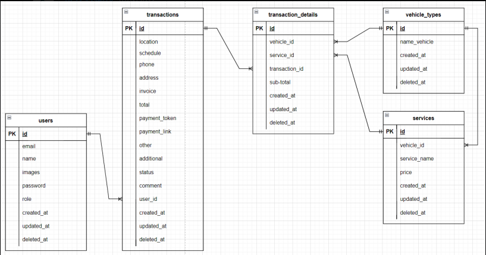

<div align="center">
  <a href="https://github.com/ALTA-Bringeee-Group1/Bringeee-API">
    
  </a>

  <p align="center">
    Capstone Program Immersive Alterra Academy
    <br />
    <a href="https://app.swaggerhub.com/apis-docs/9tw/Bengcall/1.0.0#/"><strong>| Open API Documentation |</strong></a>
    <br />
    <br />
  </p>
</div>

## 📑 About the Project

<p align="justify">Bengcall is an inovation software that very useful when someone need mechanic to repair their motorcycle fast and no waitng too long. In order to make sure Bengcall works well and following the requirements, We as a backend engginer build efficient and tested systems. In this repository, it is based on restfull APIs that use several frameworks in the go language, besides that bengcall also integrates several APIs such as midtans and google calendar</p>

## 🛠 Tools
**Backend:** 


**Deployment:** 


**Communication:**  


## 🏎️ ERD 📍



## Open Api 🔥

If you're interested in using our Open Api, this is an example of how to do so.

Final Project Capstone Program Immersive Alterra Academy
<br />
<a href="https://app.swaggerhub.com/apis-docs/9tw/Bengcall/1.0.0#/"><strong>Go to Open API »</strong></a>
<br />
<div>
      <details>
<summary>👶 Users</summary>
  
  <!---
  | Command | Description |
| --- | --- |
  --->
  
This is an explanation of the Users section's CRUD method, in bengcall there are 2 roles admin and costumer. in this section admin only can login, and for admin registration is done by developer / superadmin
 
<div>
  
| Feature User | Endpoint | Role| JWT Token | Function |
| --- | --- | --- | --- | --- |
| POST | /login  | - | NO | This is how users log in.  |
| POST | /register | - | NO | This is how users register their account. |
| GET | /users | - | YES | Users obtain their account information in this form. |
| PUT | /users | - | YES | This is how users Update their profile. |
| DELETE | /users | - | YES | This is how users Delete their profile. |

</details>

<div>
      <details>
<summary>🏘️ Transaction</summary>
  
  <!---
  | Command | Description |
| --- | --- |
  --->
  
Service transaction in Bengcall
 
<div>
  
| Feature Groups | Endpoint | Param | JWT Token | Function |
| --- | --- | --- | --- | --- |
| POST | /transaction  | - | YES | Create a new booking. |
| GET | /transaction/me | - | YES | on going booking on customer |
| GET | /transaction/{id} | id Transaction | YES | detail transaction |
| GET | /admin//transaction | - | YES | Get all booking on admin |
| PUT | /admin//transaction/{id} | id Transaction | YES | Edit transaction by admin |
| DELETE| /admin//transaction/{id} | id Transaction | YES | Delete transaction by admin. |

</details>

<div>
      <details>
<summary>🏎️ Vehicle</summary>
  
  <!---
  | Command | Description |
| --- | --- |
  --->
  
Everything about vehicle type
 
<div>
  
| Feature Groups | Endpoint | Param | JWT Token | Function |
| --- | --- | --- | --- | --- |
| POST | /admin/vehicle | - | YES | Add Vehicle type on admin. |
| GET | /vehicle | - | YES | Displaying Group detail by id. |
| DELETE| /admin/vehicle/{id} | id vehicle | YES | Delete vehicle type on admin|

</details>

<div>
      <details>
<summary>🛠 Service</summary>
  
  <!---
  | Command | Description |
| --- | --- |
  --->
  
Everything about service type in bengcall
 
<div>
  
| Feature Groups | Endpoint | Param | JWT Token | Function |
| --- | --- | --- | --- | --- |
| POST | /admin/vehicle | - | YES | Add service for vehicle on admin. |
| GET | /service | - | YES | Get spesific service type. |
| DELETE| /admin/vehicle/{id} | id vehicle | YES | Delete service type on admin|

</details>

<div>
      <details>
<summary>🛠 Vehicle Service</summary>
  
  <!---
  | Command | Description |
| --- | --- |
  --->
  
This endpoint for show all service by vehicle type on bengcall
 
<div>
  
| Feature Groups | Endpoint | Param | JWT Token | Function |
| --- | --- | --- | --- | --- |
| GET | /admin/vehicleservice | - | YES | get all service on admin. |

</details>

<div>
      <details>
<summary>👑 History</summary>
  
  <!---
  | Command | Description |
| --- | --- |
  --->
  
Show history transaction on customer
 
<div>
  
| Feature Groups | Endpoint | Param | JWT Token | Function |
| --- | --- | --- | --- | --- |
| GET | /history | - | YES | get history transaction on customer. |

</details>

<div>
      <details>
<summary>💬 Comment</summary>
  
  <!---
  | Command | Description |
| --- | --- |
  --->
  
For costumer 
 
<div>
  
| Feature Groups | Endpoint | Param | JWT Token | Function |
| --- | --- | --- | --- | --- |
| GET | /history | - | YES | get history transaction on customer. |

</details>

## 🏎️ Run Locally

Clone the project

```bash
  git clone https://github.com/ProjectBengcall/BackEndWork
```
Go to the project directory

```bash
  cd bengcall
```


## 📱 Our teams

  - Gerdo Trada Wijaya [](https://github.com/9tw)


  - Lukmanul Khakim [](https://github.com/LukmanulKhakim)

<h5>
<p align="center">:copyright: 2022 | This Repository Built with :heart: from us</p>
</h5>


